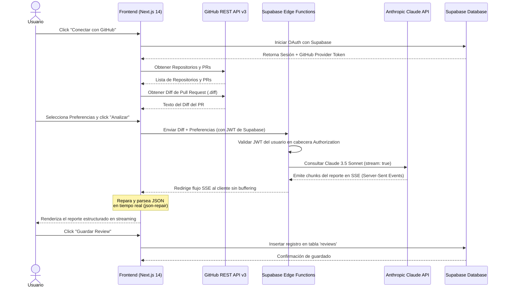

# AI Code Reviewer 🤖🚀

Un auditor automático de código que se conecta con **GitHub via OAuth**, analiza los archivos cambiados en tus **Pull Requests** en tiempo real mediante **Anthropic Claude API**, y guarda el historial de revisiones técnicas en **Supabase**.

Este proyecto fue desarrollado por **Facundo Thibaut** como parte de un challenge técnico para **AranguriApps**.

---

## 🏗️ Diagrama de Arquitectura

El siguiente diagrama detalla la interacción entre el Frontend, Supabase (Auth, DB y Edge Functions), GitHub REST API y la API de Anthropic Claude:



---

## 🛠️ Stack Tecnológico

- **Frontend:** Next.js 14 con App Router y TypeScript (Modo Estricto).
- **Estilos:** Tailwind CSS con tema oscuro premium y efectos Cyberpunk/Linear.
- **Backend / Base de datos:** Supabase.
  - **Supabase Auth:** Autenticación por OAuth de GitHub.
  - **Supabase Database:** Almacenamiento de reportes estructurados con políticas RLS activas.
  - **Supabase Edge Functions:** Controlador de la API de Claude escrito en Deno TypeScript.
- **IA:** API de Anthropic Claude (`claude-3-5-sonnet-20241022`) para el análisis técnico.
- **API Externa:** GitHub REST API v3.
- **Unit Testing:** Jest + ts-jest.
- **CI/CD:** GitHub Actions (Validación de lint, compilación y pruebas unitarias en cada push).

---

## 🧠 Decisiones Técnicas Clave

### 1. Parseo y Reparación de JSON en Tiempo Real (`json-repair.ts`)
Para lograr que el análisis técnico se renderice en la interfaz en tiempo real, palabra por palabra, decidimos streamear un formato JSON puro desde Claude.
Dado que los chunks de la respuesta llegan incompletos, el frontend no puede utilizar un `JSON.parse` estándar sobre el buffer en acumulación. Desarrollamos una utilidad liviana de **reparación de JSON** basada en el rastreo de una pila (stack) de llaves (`{`), corchetes (`[`) y comillas (`"`). Esta utilidad cierra las cadenas y colecciones abiertas al vuelo, permitiendo renderizar las listas de bugs o sugerencias a medida que se descargan.

### 2. Persistencia del GitHub OAuth Access Token
Por cuestiones de seguridad y especificación del cliente de Supabase, el `provider_token` (token de GitHub de OAuth) solo se provee en la respuesta inicial tras el callback de autenticación y no se persiste en las sesiones recargadas automáticamente desde `localStorage`.
Para mitigar esto, capturamos el `provider_token` en la página `/auth/callback` y lo guardamos temporalmente en el `localStorage` del cliente. Si el token expira o no se encuentra, el frontend cierra la sesión de Supabase automáticamente y redirige al usuario a la pantalla de Login de forma segura.

### 3. Redirección de Flujo (Stream Piping) en Edge Functions
La Edge Function `review-diff` recibe el diff del PR, valida la cabecera `Authorization` con el JWT del usuario de Supabase y contacta a Anthropic Claude. En lugar de acumular la respuesta de Claude en memoria y esperar a que termine, la función utiliza un `TransformStream` para redirigir directamente los bytes del flujo de Claude (SSE) hacia el frontend. Esto reduce drásticamente el consumo de memoria del servidor Deno y elimina la latencia de espera.

---

## 🗄️ Esquema de Base de Datos y Seguridad (RLS)

El esquema de la tabla de Supabase está diseñado de la siguiente forma:

```sql
create table public.reviews (
  id uuid primary key default gen_random_uuid(),
  user_id uuid references auth.users not null,
  repo_name text not null,
  repo_owner text not null,
  pr_number integer not null,
  pr_title text not null,
  pr_url text not null,
  review_content jsonb not null,
  score integer not null check (score >= 1 and score <= 10),
  created_at timestamp with time zone default timezone('utc'::text, now()) not null
);

-- Habilitar Row Level Security (RLS)
alter table public.reviews enable row level security;

-- Políticas de Seguridad
create policy "Users can read their own reviews" on public.reviews
  for select using (auth.uid() = user_id);

create policy "Users can insert their own reviews" on public.reviews
  for insert with check (auth.uid() = user_id);

create policy "Users can delete their own reviews" on public.reviews
  for delete using (auth.uid() = user_id);
```

Habilitamos índices en `user_id`, `(repo_owner, repo_name)` y `created_at` para acelerar los filtros de historial y las búsquedas por repositorio en el dashboard.

---

## 🚀 Cómo Correr el Proyecto Localmente

### 📋 Requisitos Previos
- Node.js (v18.x o v20.x recomendado)
- Supabase CLI instalado localmente (para probar Edge Functions locales)
- Una cuenta en Supabase y una GitHub OAuth App configurada.

### 1. Clonar el repositorio y configurar variables de entorno

Creá un archivo `.env.local` en la raíz del proyecto para Next.js:
```env
NEXT_PUBLIC_SUPABASE_URL=tu_supabase_project_url
NEXT_PUBLIC_SUPABASE_ANON_KEY=tu_supabase_anon_key
```

### 2. Configurar la Edge Function local

En el directorio de Supabase local o en el panel de control de tu proyecto remoto, tenés que setear la API key de Anthropic.
Para configurar la variable en producción:
```bash
supabase secrets set ANTHROPIC_API_KEY="tu-api-key-de-claude"
```
Si estás ejecutando las funciones de Supabase de manera local:
Creá un archivo `.env` dentro de `supabase/functions/review-diff/` con:
```env
ANTHROPIC_API_KEY=tu_api_key_de_claude
```

### 3. Instalar dependencias y correr la aplicación

Instalá las dependencias del frontend:
```bash
npm install
```

Corré el servidor de desarrollo local de Next.js:
```bash
npm run dev
```

La aplicación estará disponible en [http://localhost:3000](http://localhost:3000).

### 4. Ejecutar las Pruebas Unitarias

Para verificar que el formateador y reparador de JSON en streaming funciona de forma correcta:
```bash
npm run test
```

---

## 🎨 Guía de Commits del Proyecto

Para mantener el historial ordenado, seguimos la especificación de **Commits Semánticos en español**:
- `feat:` Nuevas características de código (ej: `feat: agrego pantalla de login con OAuth de GitHub`)
- `fix:` Corrección de errores en código (ej: `fix: corrijo manejo de errores en Edge Function`)
- `chore:` Tareas de mantenimiento, dependencias o builds (ej: `chore: inicializo proyecto Next.js`)
- `test:` Inclusión o arreglo de pruebas unitarias (ej: `test: agrego pruebas para json-repair`)
- `docs:` Modificaciones de documentación (ej: `docs: actualizo el README con el diagrama de arquitectura`)
